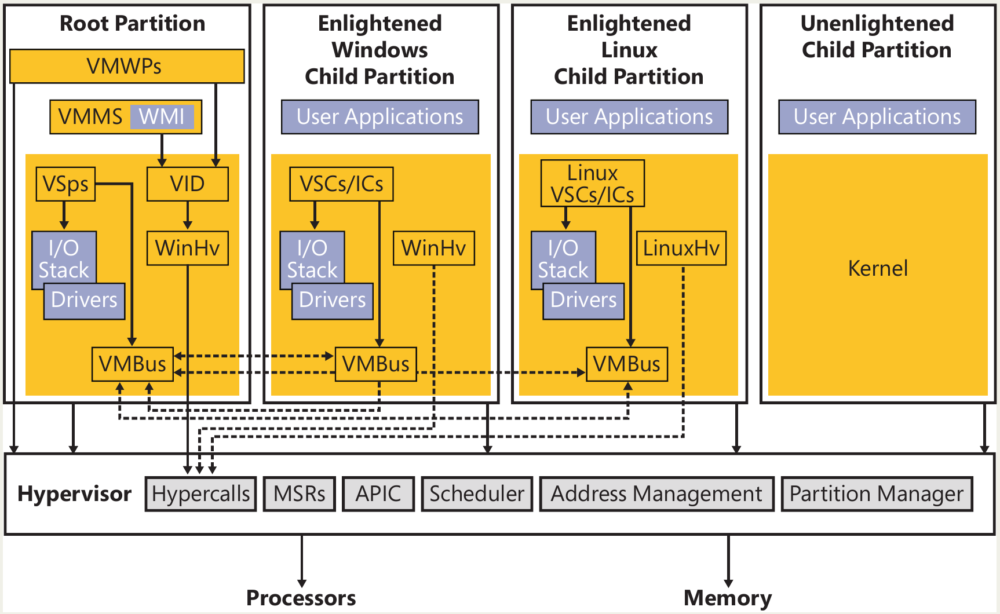
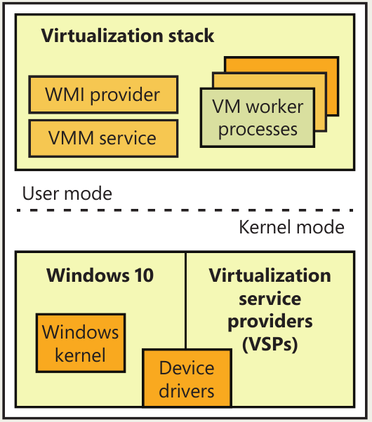
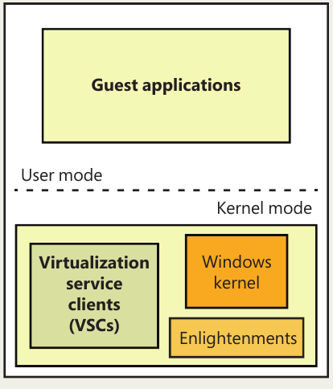

# Chapter 9: Virtualization Technologies

## The Windows hypervisor

- Hyper-V, also called the **Windows hypervisor**, is a **type-1 / native / bare-metal hypervisor**. This means it runs directly on the physical hardware rather than running as a normal application on top of an existing OS.
- However, Windows Hyper-V is slightly special compared to the classic mental model of a standalone bare-metal hypervisor:
  - The hypervisor runs below Windows.
  - The main Windows installation becomes the **root OS** or **root partition**.
  - Guest virtual machines run beside it as separate partitions.
  - The root OS is aware that the hypervisor exists and communicates with it.
  - VM management is integrated into Windows through normal mechanisms such as **WMI**, services, and other OS management APIs.
- This differs from a **type-2 / hosted hypervisor**, where the hypervisor runs like an application on top of a normal host OS. Examples would be classic desktop virtualization products where the host OS remains the true owner of the hardware.
- The root OS contains **enlightenments**. An **enlightenment** is a special optimization in the Windows kernel or in device drivers that detects that the system is running under a hypervisor and changes behavior accordingly.
- Instead of pretending the machine is fully native, enlightened (**paravritualized**) components cooperate with the hypervisor to do things more efficiently.

<p align="center"></p>

- At the bottom of the virtualization architecture is the **hypervisor**. It is launched very early during boot and exposes services to the rest of the virtualization stack through the **hypercall interface**.
- The hypervisor startup begins during the Windows boot process. The **Windows Loader** decides whether to start:
  - the Hyper-V hypervisor
  - the Secure Kernel, when VBS-related features are enabled
- If the hypervisor is started, Windows uses **Hvloader.dll** to detect the hardware platform and load the correct hypervisor binary.
- Because virtualization extensions differ between CPU vendors and architectures, Windows ships different hypervisor binaries:

| Platform  | Hypervisor binary |
| --------- | ----------------- |
| Intel x64 | `Hvix64.exe`      |
| AMD x64   | `Hvax64.exe`      |
| ARM64     | `Hvaa64.exe`      |

### Partitions, processes, and threads

- The central isolation abstraction in Hyper-V is the **partition**.
- A partition represents an OS instance under the Windows hypervisor. Hyper-V does not mainly use the classic terms **host** and **guest**. Instead, it uses:

| Traditional term | Hyper-V term        |
| ---------------- | ------------------- |
| Host             | **Root partition**  |
| Guest VM         | **Child partition** |

- A partition contains, at the hypervisor level:
  - assigned physical memory
  - one or more **virtual processors** / **VPs**
  - local virtual APICs
  - virtual timers
- Other things commonly associated with a VM, such as virtual motherboard, virtual devices, synthetic peripherals are not really hypervisor concepts. They belong mostly to the **virtualization stack** running in the root partition.
- A Hyper-V system always has at least one partition: the **root partition**.
- The root partition is where the main Windows OS runs. It is special because it provides:
  - the virtualization stack
  - hardware device drivers
  - VM management infrastructure
  - control over child partitions
  - I/O handling on behalf of guests
  - management services/APIs
- Only the root partition has **full control** over the machine from the Windows virtualization model’s point of view.
- Even though the hypervisor itself is loaded very early by the Windows Loader, before the root OS fully exists, the hypervisor stays small. The root Windows OS later provides the larger virtualization infrastructure.
- Each guest OS runs inside a **child partition**.
  - A child partition can include tools/components that improve performance or manageability, such as Hyper-V integration components or **enlightened drivers**.
  - Child partitions usually do **not** access physical hardware directly. Their I/O operations are typically intercepted or routed through the root partition.
  - There are exceptions, such as certain **passthrough** or **direct device assignment** scenarios, but the general design is that the root partition owns the real hardware.
- Partitions are organized **hierarchically**.
  - The **root partition** controls the child partitions. For certain events occurring inside a child partition, the root receives notifications called **intercepts**.
  - These intercepts allow the root/virtualization stack to handle events that require emulation, management, policy enforcement, or I/O forwarding.

<p align="center"></p>

- The root partition’s own hardware accesses are mostly passed through by the hypervisor, meaning the root OS can usually talk directly to the hardware through normal Windows drivers. Child partitions are much more restricted.
- A major design goal of the Windows hypervisor is to keep it small and modular, closer to a **microkernel-like** design rather than a large monolithic hypervisor.

```text
Hypervisor: small low-level isolation and scheduling layer
Root partition: Windows drivers + virtualization stack + VM management
Child partitions: guest operating systems
```

#### Child partitions

- A **child partition** is an OS instance running alongside the root/parent partition. It corresponds to what is usually called a **guest VM**, although Hyper-V terminology uses **child partition** instead.
- Unlike the parent/root partition, a child partition has a heavily restricted view of the system.
- The **root partition** has broad access to: APIC, I/O ports, its own physical memory and real hardware through Windows drivers.
- But even the root partition does **not** access:
  - hypervisor physical memory
  - Secure Kernel physical memory
- A **child partition**, by contrast, is restricted to its own **Guest Physical Address (GPA) space**.
- The GPA space is the child’s view of “physical memory,” but it is not real machine physical memory directly. It is managed and translated by the hypervisor.

<p align="center"></p>

```text
Child partition
    → talks to virtual/synthetic device
    → request goes to root virtualization stack
    → root uses real Windows hardware driver
    → physical device
```

- So child partitions are **consumers** of **virtualization services**, not providers of them.
- A child partition has **fewer** virtualization-related components than the parent partition. This is because it does not run the virtualization stack. It only needs enough support to communicate with the stack running in the root partition.
- In a Windows child partition, these components are usually **integration/enlightenment** components that improve:
  - performance
  - device access
  - time synchronization
  - shutdown/save/restore behavior
  - synthetic device communication
  - management from the root partition

#### Processes and threads

Internally, the Windows hypervisor represents a VM using several core data structures. The important mapping is:

```text
VM / Partition
    → `VM_PARTITION` - represents the virtual machine from the hypervisor’s point of view.
    → `TH_PROCESS`
        → contains address-space / memory-management state
        → contains hypervisor threads
            → each `TH_THREAD` is tied to a `VM_VP`
```

A partition contains:

- guest physical memory
- one or more virtual processors
- scheduling-related state
- memory-management structures
- address-space metadata

So at the hypervisor level, a VM is not primarily “a set of virtual devices.” It is mainly a combination of **memory + virtual processors + scheduling/memory state**.

- Each **virtual processor**, or **VP**, is internally represented by `VM_VP`.
- A VP is the unit that gets scheduled by the hypervisor.
- The hypervisor has its own scheduler, similar conceptually to the NT kernel scheduler, but operating at the virtualization layer. Its job is to dispatch VPs from different partitions onto physical CPUs.
- This matters because Hyper-V does not schedule “VMs” directly. It schedules their **virtual processors**.
- For every VP that the hypervisor creates, it also creates a corresponding hypervisor thread: `TH_THREAD`.
- The **TH_THREAD** is the glue between a VP and the hypervisor’s schedulable execution unit.
  - It represents the **current physical execution context** and contains important execution/scheduling fields, including:
      - the thread execution stack
      - scheduling data
      - pointer to the associated virtual processor, `VM_VP`
      - entry point of the **thread dispatch loop**
      - pointer to the owning hypervisor process, `TH_PROCESS`
- So the relationship is:

```text
VM_VP
    ↔ TH_THREAD
```
  - The VP represents the virtual CPU state.
  - The hypervisor thread represents the schedulable execution context used to run that VP.

A hypervisor process is represented by:

```text
TH_PROCESS
```

This is not a normal Windows user-mode process. It is a hypervisor-internal object.

- A **TH_PROCESS** represents a partition and acts as the container for that partition’s address-space state.
- It contains:
  - list of hypervisor threads
  - scheduling data
  - physical CPU affinity allowed for that partition/process
  - pointer to partition memory structures
  - physical and virtual address-space metadata
- The memory-related fields include things such as:
  - memory compartment
  - reserved pages
  - page directory root
  - other partition memory-management data

So the relationship is:

```text
TH_PROCESS
    → represents a partition
    → contains TH_THREAD objects
    → each TH_THREAD is backed by a VM_VP
```

When the hypervisor creates a new partition:

1. It builds a `VM_PARTITION`.
2. It creates a `TH_PROCESS` for that partition.
3. It creates one or more `VM_VP` objects.
4. For each `VM_VP`, it creates a corresponding `TH_THREAD`.
5. Those threads become schedulable units for the hypervisor scheduler.

In simplified form:

```text
Create partition
    ↓
VM_PARTITION
    ↓
TH_PROCESS
    ↓
VM_VP(s)
    ↓
TH_THREAD(s)
    ↓
Scheduled onto physical CPUs
```
