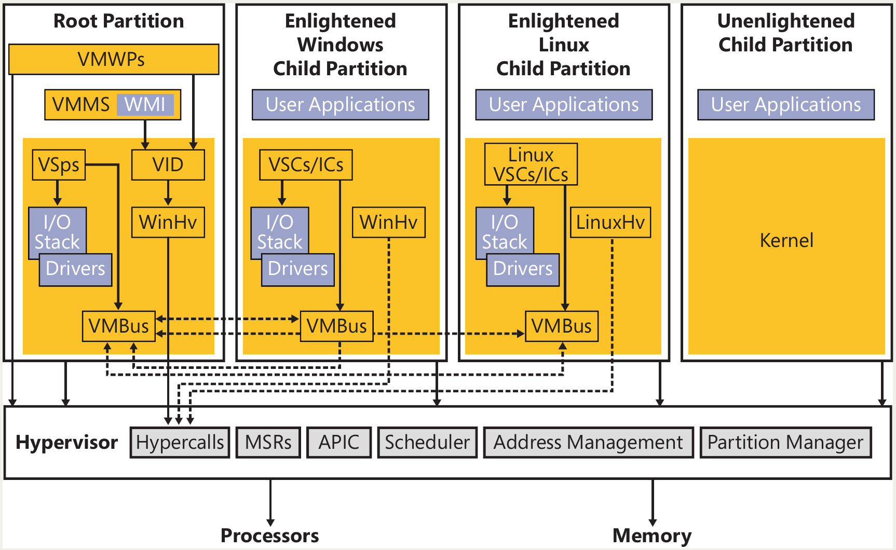
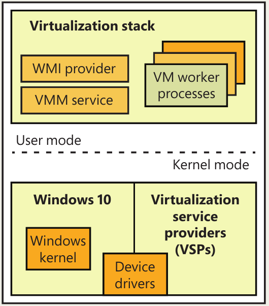
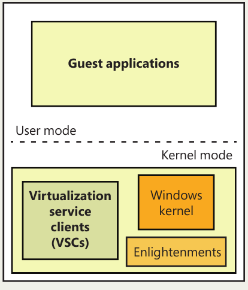
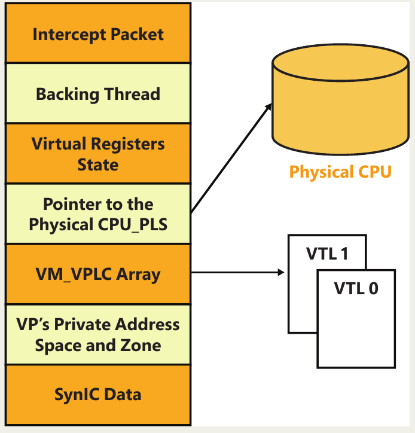
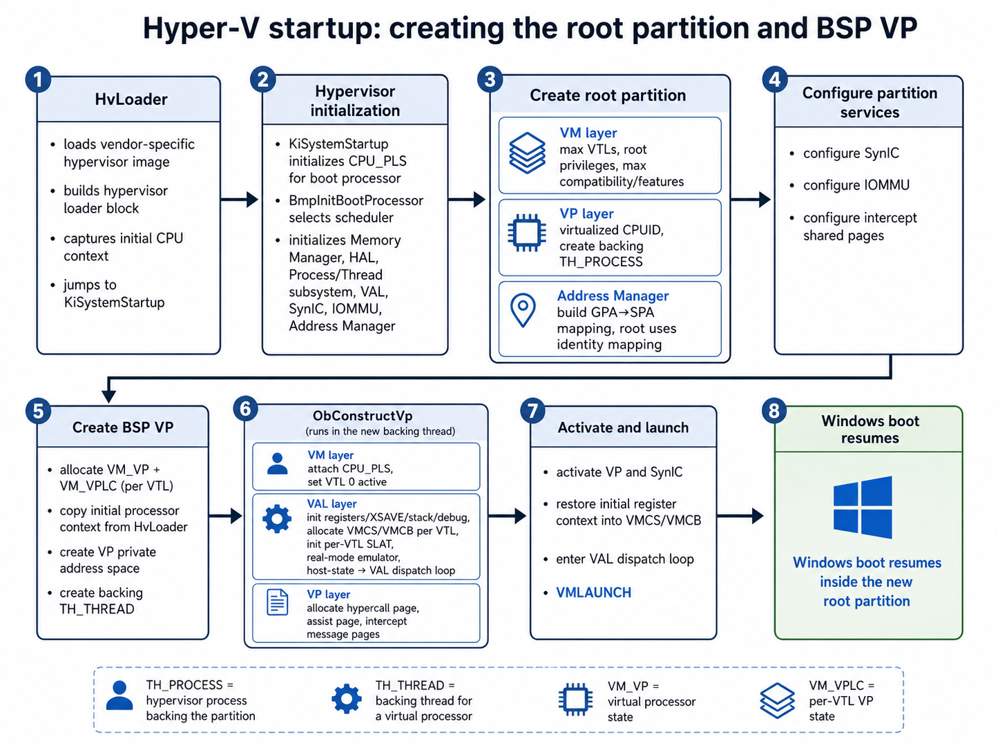
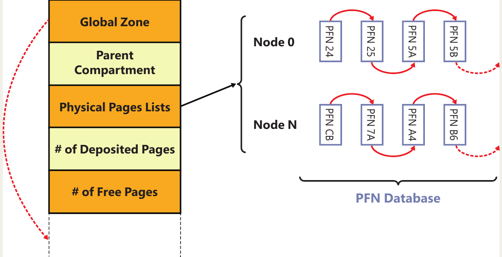
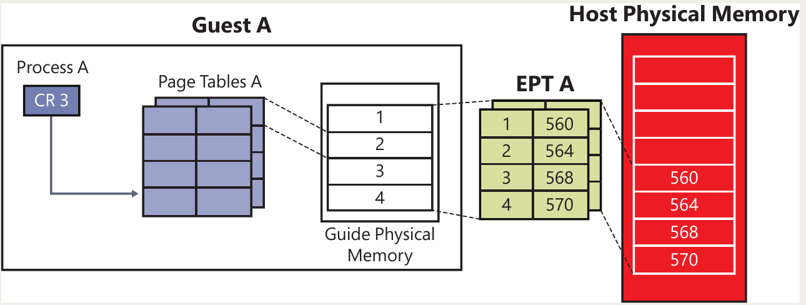

# Chapter 9: Virtualization Technologies

## The Windows hypervisor

- Hyper-V, also called the **Windows hypervisor**, is a **type-1 / native / bare-metal hypervisor**. This means it runs directly on the physical hardware rather than running as a normal application on top of an existing OS.
- However, Windows Hyper-V is slightly special compared to the classic mental model of a standalone bare-metal hypervisor:
  - The hypervisor runs below Windows.
  - The main Windows installation becomes the **root OS** or **root partition**.
  - Guest virtual machines run beside it as separate partitions.
  - The root OS is aware that the hypervisor exists and communicates with it.
  - VM management is integrated into Windows through normal mechanisms such as **WMI**, services, and other OS management APIs.
- This differs from a **type-2 / hosted hypervisor**, where the hypervisor runs like an application on top of a normal host OS. Examples would be classic desktop virtualization products where the host OS remains the true owner of the hardware.
- The root OS contains **enlightenments**. An **enlightenment** is a special optimization in the Windows kernel or in device drivers that detects that the system is running under a hypervisor and changes behavior accordingly.
- Instead of pretending the machine is fully native, enlightened (**paravritualized**) components cooperate with the hypervisor to do things more efficiently.

<p align="center"></p>

- At the bottom of the virtualization architecture is the **hypervisor**. It is launched very early during boot and exposes services to the rest of the virtualization stack through the **hypercall interface**.
- The hypervisor startup begins during the Windows boot process. The **Windows Loader** decides whether to start:
  - the Hyper-V hypervisor
  - the Secure Kernel, when VBS-related features are enabled
- If the hypervisor is started, Windows uses **Hvloader.dll** to detect the hardware platform and load the correct hypervisor binary.
- Because virtualization extensions differ between CPU vendors and architectures, Windows ships different hypervisor binaries:

| Platform  | Hypervisor binary |
| --------- | ----------------- |
| Intel x64 | `Hvix64.exe`      |
| AMD x64   | `Hvax64.exe`      |
| ARM64     | `Hvaa64.exe`      |

### Partitions, processes, and threads

- The central isolation abstraction in Hyper-V is the **partition**.
- A partition represents an OS instance under the Windows hypervisor. Hyper-V does not mainly use the classic terms **host** and **guest**. Instead, it uses:

| Traditional term | Hyper-V term        |
| ---------------- | ------------------- |
| Host             | **Root partition**  |
| Guest VM         | **Child partition** |

- A partition contains, at the hypervisor level:
  - Assigned physical memory
  - One or more **virtual processors** / **VPs**
  - Local virtual APICs
  - Virtual timers
- Other things commonly associated with a VM, such as virtual motherboard, virtual devices, synthetic peripherals are not really **hypervisor concepts**. They belong mostly to the **virtualization stack** running in the root partition.
- A Hyper-V system always has at least one partition: the **root partition**.
- The root partition is where the main Windows OS runs. It is special because it provides:
  - The virtualization stack
  - Hardware device drivers
  - VM management infrastructure
  - Control over child partitions
  - I/O handling on behalf of guests
  - Management services/APIs
- Only the root partition has **full control** over the machine from the Windows virtualization model’s point of view.
- Even though the hypervisor itself is loaded very early by the Windows Loader, before the root OS fully exists, the hypervisor stays small. The root Windows OS later provides the larger virtualization infrastructure.
- Each guest OS runs inside a **child partition**.
  - A child partition can include tools/components that improve performance or manageability, such as Hyper-V integration components or **enlightened drivers**.
  - Child partitions usually do **not** access physical hardware directly. Their I/O operations are typically intercepted or routed through the **root partition**.
  - There are exceptions, such as certain **passthrough** or **direct device assignment** scenarios, but the general design is that the root partition owns the real hardware.
- Partitions are organized **hierarchically**.
  - The **root partition** controls the child partitions. For certain events occurring inside a child partition, the root receives notifications called **intercepts**.
  - These intercepts allow the root/virtualization stack to handle events that require emulation, management, policy enforcement, or I/O forwarding.

<p align="center"></p>

- The root partition’s own hardware accesses are mostly passed through by the hypervisor, meaning the root OS can usually talk **directly** to the hardware through normal **Windows drivers**. Child partitions are much more restricted.
- A major design goal of the Windows hypervisor is to keep it small and modular, closer to a **microkernel-like** design rather than a large monolithic hypervisor.

```text
Hypervisor: small low-level isolation and scheduling layer
Root partition: Windows drivers + virtualization stack + VM management
Child partitions: guest operating systems
```

### Child partitions

- A **child partition** is an OS instance running alongside the root/parent partition. It corresponds to what is usually called a **guest VM**, although Hyper-V terminology uses **child partition** instead.
- Unlike the parent/root partition, a child partition has a heavily restricted view of the system.
- The **root partition** has broad access to: APIC, I/O ports, its own physical memory and real hardware through Windows drivers.
- But even the root partition does **not** access:
  - hypervisor physical memory
  - Secure Kernel physical memory
- A **child partition**, by contrast, is restricted to its own **Guest Physical Address (GPA) space**.
- The GPA space is the child’s view of “physical memory,” but it is not real machine physical memory directly. It is managed and translated by the hypervisor.

<p align="center"></p>

```text
Child partition
    → talks to virtual/synthetic device
    → request goes to root virtualization stack
    → root uses real Windows hardware driver
    → physical device
```

- So child partitions are **consumers** of **virtualization services**, not providers of them.
- A child partition has **fewer** virtualization-related components than the parent partition. This is because it does not run the virtualization stack. It only needs enough support to communicate with the stack running in the root partition.
- In a Windows child partition, these components are usually **integration/enlightenment** components that improve:
  - Pperformance
  - Device access
  - Time synchronization
  - Shutdown/save/restore behavior
  - Synthetic device communication
  - Management from the root partition

### Processes and threads

The Windows hypervisor represents each VM as a **partition** (`VM_PARTITION`), mainly composed of guest physical memory and one or more **virtual processors** (`VM_VP`), where each VP is treated as a schedulable entity that the hypervisor scheduler dispatches onto physical CPUs.

For each VP, the hypervisor creates a **hypervisor thread** (`TH_THREAD`), which acts as the schedulable execution context for that VP and contains its stack, scheduling metadata, dispatch-loop entry point, pointer to the associated `VM_VP`, and pointer to the owning hypervisor process.

A **hypervisor process** (`TH_PROCESS`) represents the partition as a process-like container for its address space and execution state; it owns the list of `TH_THREAD` objects, scheduling information such as physical CPU affinity, and pointers to partition memory-management structures such as the memory compartment, reserved pages, and page-directory root.

👉 The key model is: **partition = VM container**, **hypervisor process = address-space/scheduling container for that partition**, **VP = virtual CPU**, and **hypervisor thread = schedulable unit backing a VP**.

When the hypervisor creates a new partition:

1. It builds a `VM_PARTITION`.
2. It creates a `TH_PROCESS` for that partition.
3. It creates one or more `VM_VP` objects.
4. For each `VM_VP`, it creates a corresponding `TH_THREAD`.
5. Those threads become schedulable units for the hypervisor scheduler.

### Enlightenments

- Enlightenments are **hypervisor-aware** code paths inside the Windows kernel and drivers that detect execution inside a child partition and replace expensive virtualized hardware behavior with more efficient cooperation with the hypervisor, usually through **hypercalls**.
- A typical example is a **long spin-wait loop**: instead of wasting a physical CPU while a VP waits, Windows can notify the hypervisor, allowing it to track the wait condition and potentially **schedule another VP** on that physical processor until the original VP can make progress.
- Other enlightenments optimize operations such as **interrupt-state transitions** and **APIC access**, where Windows coordinates directly with the hypervisor instead of triggering real **APIC accesses** that would then need to be **trapped** and **virtualized**.
- The important memory-management example is **TLB flushing**: on native multiprocessor Windows, flushing stale TLB entries often requires sending **IPIs** to other processors, but in a VM this would be inefficient because physical CPUs may currently be running **VPs from unrelated partitions**, so enlightened Windows issues a hypercall asking the hypervisor to flush only the **relevant TLB state** for that child partition.

### Partition’s privileges, properties, and version features

- When a partition is first created, usually by **VID.sys** (Virtualization Infrastructure Driver), it initially has **no VPs**, and this is the only window where VID/root can adjust the partition’s **privileges**; once even one VP starts executing, the hypervisor refuses later privilege changes 🤷‍♀️.
- A partition privilege defines what the enlightened OS inside that partition is allowed to do through **hypercalls** or **synthetic MSRs**, and the default set depends on the partition type: **both root and child partitions** get basic self-management privileges such as ➡️accessing runtime/reference time, SynIC timers/registers, virtual APIC assist page, hypercall MSRs/code page, VP idle/index/TSC state, VSM/per-VTL synthetic registers, AP startup, and fast hypercall support.
- The **root partition** gets the powerful management privileges: ➡️creating and referencing child partitions, depositing/withdrawing memory from a partition compartment, creating and managing connection ports, posting messages/signaling events, mapping hypervisor statistics pages, enabling/querying hypervisor debugging, scheduling child VPs, accessing child SynIC synthetic MSRs, and triggering enlightened system reset.
- The **child partition** has only **limited extra privileges**, mainly to generate an extended hypercall intercept into the root partition and to notify the root scheduler that an event has been signaled so the guest’s VP-backed thread can be prioritized or rescheduled.
- An **EXO partition** has no default privileges.
- Partition **properties** are different from privileges because they can be queried or changed at any time, and they cover runtime categories such as scheduler settings like ➡️ Cap/Weight/Reserve, suspend/resume time properties, hypervisor debugger configuration, virtual hardware resource properties such as TLB size or SGX support, and compatibility properties tied to the VM’s configured virtual hardware level.
- The VM’s **compatibility level**, stored in its configuration and passed by VID to the hypervisor, controls which virtual hardware features are exposed to the guest VP; for example, older compatibility levels before _Windows 10 RS1_ hide guest **PAT** support even if the physical CPU supports it, while newer compatibility levels allow the hypervisor to expose PAT registers to the guest.
- The **root partition** is special at boot because the hypervisor gives it the **highest compatibility level**, allowing the root Windows OS to use all hardware features supported by the physical platform.

## The hypervisor startup

After **HvLoader** loads the CPU-vendor-specific hypervisor image and builds the **hypervisor loader block**, it captures enough initial processor context for the hypervisor to start the first VP, switches into a newly created address space, and transfers execution to the hypervisor entry point, **`KiSystemStartup`**.

`KiSystemStartup` runs only on the **boot processor**, prepares the CPU for hypervisor execution, and initializes **`CPU_PLS`**, the hypervisor’s per-physical-processor structure, roughly analogous to NT’s **PRCB** and quickly addressable through the **GS segment**.

The real boot-processor initialization is then delegated to **`BmpInitBootProcessor`**, which queries platform-specific virtualization capabilities such as **EPT**, **VPID**, etc.., chooses the hypervisor scheduler, and initializes **nested-enlightenment** support for scenarios where Hyper-V itself runs as an **L1 hypervisor** under an **L0 hypervisor**.

Scheduler selection depends on system type: on Intel/AMD server systems the default is usually the **core scheduler**, while on client systems, including ARM64, the default is the **root scheduler**, though it can be overridden through the **`hypervisorschedulertype`** BCD option.

`BmpInitBootProcessor` then initializes the hypervisor’s major internal subsystems: the memory manager with its **PFN database** and **root compartment**, the hypervisor HAL, the process/thread subsystem according to the selected scheduler, the special **system process** and initial thread used for hypervisor-internal execution, the **Virtualization Abstraction Layer / VAL**, **SynIC**, **IOMMU**, and the **Address Manager**.

The **VAL** abstracts CPU virtualization differences across Intel, AMD, and ARM64, and contains the platform-specific code for features such as Intel unrestricted guest mode, EPT, SGX, MBEC, and equivalent virtualization mechanisms on other architectures.

The **Address Manager / AM** owns the mapping between a partition’s **guest physical address space / GPA**, called an **address domain**, and real **system physical memory**; older Hyper-V could use shadow page tables, but since Windows 8.1 it relies on hardware SLAT mechanisms such as Intel **EPT**, AMD **NPT**, and ARM64 stage-2 translation.

After these subsystems are initialized, the hypervisor completes the boot processor’s `CPU_PLS` by allocating the hardware-dependent virtualization control structures, such as **VMCS** on Intel or **VMCB** on AMD, enables virtualization with the first **VMXON**-equivalent operation, and finally initializes the per-processor interrupt-mapping structures.

### The creation of the root partition and the boot virtual processor

After the hypervisor is initialized, its first major job is to create the **root partition** and its first virtual processor, the **BSP VP**, which is the VP used to resume the Windows boot process under Hyper-V control.

Root partition creation follows roughly the same layered process as child partition creation: the **VM layer** configures maximum VTL **support**, assigns **partition privileges** according to type, and enables features according to the partition **compatibility** level, with the root partition receiving the maximum feature set; the **VP layer** initializes the virtualized CPUID state shared by all VPs in the partition and creates the hypervisor process backing the partition; and the **Address Manager** builds the initial GPA→SPA mapping, using EPT on Intel or NPT on AMD, with the root partition using identity mapping so its guest physical memory corresponds directly to system physical memory.

Once **SynIC**, **IOMMU**, and **intercept shared pages** are configured, the hypervisor creates the root partition’s BSP VP, represented by a large **`VM_VP`** structure containing platform-dependent CPU state, register/debug/XSAVE/stack data, the VP private address space, a pointer to the backing hypervisor thread, a pointer to the physical CPU currently executing it, and an array of **`VM_VPLC`** structures tracking per-VTL state.

<p align="center"></p>

`VmAllocateVp` allocates the memory for `VM_VP`, its platform-specific area, and one `VM_VPLC` per supported VTL from the partition compartment, copies the initial processor context captured earlier by **HvLoader**, creates and attaches to the VP private address space when address-space isolation is enabled, and then creates the VP’s backing thread.

A key detail is that VP construction then continues inside the newly **created backing thread**: the main hypervisor system thread waits, the scheduler selects the new thread, and that thread runs **`ObConstructVp`**, which attaches the current `CPU_PLS` to the VP, sets **VTL 0** active, initializes platform-specific VP state through the **VAL**, allocates per-VTL VMCS/VMCB structures and per-VTL SLAT tables, initializes the real-mode emulator, and sets the VMCS host-state to return to the hypervisor’s VAL dispatch loop.

The VP layer also allocates shared guest/hypervisor pages such as the **hypercall page**, and for each VTL the **assist** and **intercept message** pages, which are used to expose code/data paths between the guest and the hypervisor.

When construction finishes, the VP dispatch thread activates the VP and its **SynIC**, restores the initial register context into the VMCS/VMCB if this is the root BSP VP, signals that VP initialization is complete so the main system thread can enter idle, and enters the **VAL dispatch loop**.

Because the VP is new, the VAL dispatch loop prepares it for first execution and performs **`VMLAUNCH`**, causing execution to resume exactly where **HvLoader** transferred control to the hypervisor, except now Windows boot continues inside the newly created **root partition** rather than directly on raw hardware.

<p align="center"></p>

## The hypervisor memory manager

Hyper-V manages physical memory through **memory compartments**. Before startup, `Hvloader.dll` estimates and reserves the pages required by the hypervisor and root partition, including memory for the IOMMU, PFN database, SLAT tables, and HAL address space. These pages are then used to create the root compartment.

<p align="center"></p>

A compartment owns a set of deposited physical pages organized by NUMA node and tracked through the hypervisor’s PFN database. Child compartments receive pages from the root and return their remaining pages when destroyed. If an internal hypervisor allocation fails, the system crashes; if a child partition lacks memory, Hyper-V returns `INSUFFICIENT_MEMORY`, allowing the root partition to deposit more pages with `HvDepositMemory` before retrying the operation.

Each compartment also receives a private virtual-address range called a **zone**. Hyper-V uses a single root page table with reserved entries that dynamically switch mappings between compartment zones and virtual-processor address spaces.

### Partitions’ physical address space

Each partition has a physical address space that uses **second-level address translation** (SLAT) to map **guest physical addresses** (GPAs) to **system physical addresses** (SPAs). SLAT is called EPT by Intel, NPT by AMD, and Stage 2 Address Translation by ARM. A guest therefore performs two translations: its OS translates virtual addresses to GPAs, and the processor uses SLAT to translate those GPAs to SPAs.

<p align="center"></p>

The root partition uses an **identity mapping**, where each GPA maps to the same SPA. Hyper-V creates separate SLAT tables for every supported **Virtual Trust Level** (VTL); these tables contain similar mappings but apply different permissions to isolate the VTLs. Hypervisor-owned pages are reserved and inaccessible to the partition.

For a **child** partition, Hyper-V initially creates only the **root SLAT** table for each VTL. The VID driver then allocates physical pages from the root partition, asks Hyper-V to pre-create the required SLAT hierarchy, and maps the pages using the `HvMapGpaPages` hypercall. If the child’s memory compartment lacks pages for these structures, VID deposits additional memory into it. Hyper-V finally builds the mappings with VTL-specific protections, using **large pages** where possible to reduce the number of translation levels.
