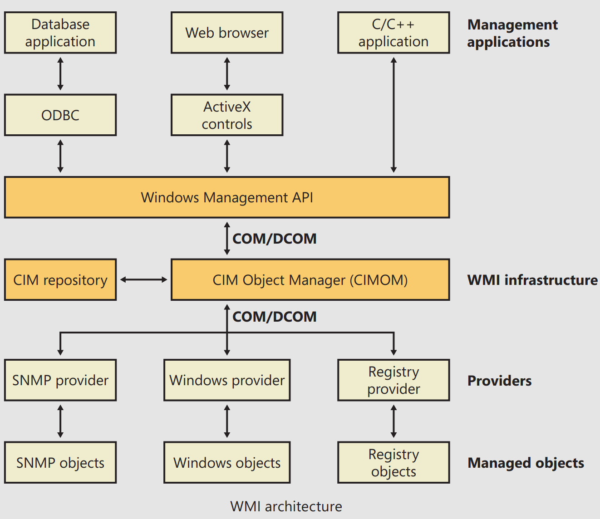

# Chapter 4: Management Mechanisms

## The Registry

## Services

## Unified Background Process Manager

## Windows Management Instrumentation (WMI)

- WMI is an implementation of **Web-Based Enterprise Management (WBEM)** , a standard that the **Distributed Management Task Force (DMTF)** (an industry consortium) defines.
- The WBEM standard encompasses the design of an extensible enterprise data-collection and data-management facility that has the flexibility and extensibility required to manage local and remote systems that comprise arbitrary components

### WMI Architecture

- WMI consists of four main components:

- The WMI infrastructure, the heart of which is the **Common Information Model (CIM) Object Manager (CIMOM)**, is the glue that binds management applications and providers.
  - Serves as the **object-class store** and, in many cases, as the storage manager for persistent object properties.
  - WMI implements the store, or repository, as an on-disk database named the **CIMOM Object Repository**.
- Windows programs and scripts (such as Windows PowerShell) use the **WMI COM API**, the primary management API, to directly interact with WMI.
- As they are for management applications, WMI COM interfaces constitute the primary API for providers. However, unlike **management applications**, which are **COM clients**, providers are COM or Distributed COM (DCOM) **servers** (that is, the providers implement COM objects that WMI interacts with).